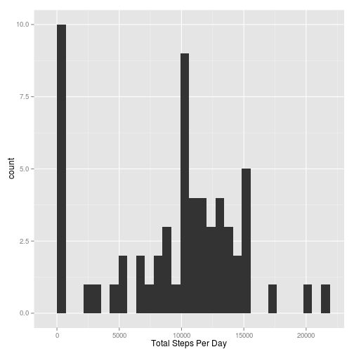
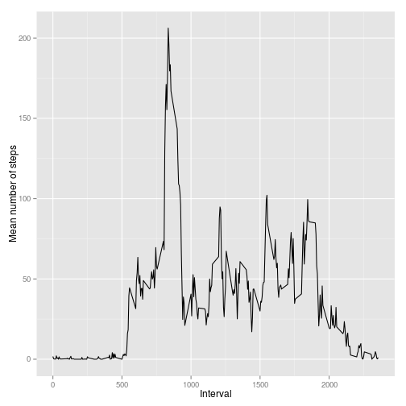
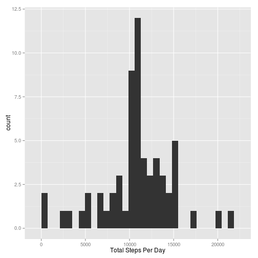
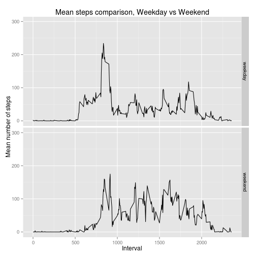

This is the R Markdown document for Project 1. Markdown is a simple formatting syntax for authoring HTML, PDF, and MS Word documents. For more details on using R Markdown see <http://rmarkdown.rstudio.com>.

###Introduction
It is now possible to collect a large amount of data about personal movement using activity monitoring devices such as a Fitbit, Nike Fuelband, or Jawbone Up. These type of devices are part of the “quantified self” movement – a group of enthusiasts who take measurements about themselves regularly to improve their health, to find patterns in their behavior, or because they are tech geeks. But these data remain under-utilized both because the raw data are hard to obtain and there is a lack of statistical methods and software for processing and interpreting the data.

This assignment makes use of data from a personal activity monitoring device. This device collects data at 5 minute intervals through out the day. The data consists of two months of data from an anonymous individual collected during the months of October and November, 2012 and include the number of steps taken in 5 minute intervals each day.

###Loading and preprocessing the data
First, we load any necessary libraries.  Warnings can be safely ignored.


```r
# Load necessary libraries
library(ggplot2)
library(dplyr)
```

Next, load the data for the project and show a summary of that data.


```r
df <- read.csv("./data/activity.csv")
summary(df)
```

```
##      steps                date          interval     
##  Min.   :  0.00   2012-10-01:  288   Min.   :   0.0  
##  1st Qu.:  0.00   2012-10-02:  288   1st Qu.: 588.8  
##  Median :  0.00   2012-10-03:  288   Median :1177.5  
##  Mean   : 37.38   2012-10-04:  288   Mean   :1177.5  
##  3rd Qu.: 12.00   2012-10-05:  288   3rd Qu.:1766.2  
##  Max.   :806.00   2012-10-06:  288   Max.   :2355.0  
##  NA's   :2304     (Other)   :15840
```

###What is mean total number of steps taken per day?
Compute the mean and median total number of steps taken per day and show a histogram of the distribution of the total steps taken per day.


```r
# Compute and plot mean total number of steps taken per day
totalStepsPerDay<-aggregate(df$steps, list(df$date), function(x) sum(x,na.rm=TRUE))
qplot(x, data=totalStepsPerDay, xlab="Total Steps Per Day")
```

 

```r
# Compute the average and median
meanSteps = round(mean(totalStepsPerDay$x))
medianSteps = round(median(totalStepsPerDay$x))
```

The mean number of steps per day is 9354 and the median number of steps per day is 10395

###What is the average daily activity pattern?
Show average number of steps taken per time interval.


```r
# Compute and plot the average number of steps per time interval
intervals = unique(df$interval)
aveStepsPerInterval<-aggregate(df$steps, list(df$interval), function(x) mean(x,na.rm=TRUE))
ggplot(data=aveStepsPerInterval, aes(x=Group.1, y=x)) +
    geom_line() +
    xlab("Interval") +
    ylab("Mean number of steps")
```

 

Now find and report the interval with the maximum average number of steps.


```r
maxAveSteps <- max(aveStepsPerInterval$x)
idxMax <- which(aveStepsPerInterval$x == maxAveSteps)
intervalMax <- intervals[idxMax]
```

The maximum average steps taken in any interval is 206 and is in the interval 835

###Imputing missing values


```r
idxNa <- which(is.na(df[,1:3]))
```

The total number of missing values is 2304

Now fill in the missing values with the average steps for that interval, storing the data in a new column.


```r
df$stepsNoNa <-df$steps
for (i in 1:length(idxNa)) {
    idxFound <- which(df$interval[idxNa[i]] == intervals)
    df$stepsNoNa[idxNa[i]] <- aveStepsPerInterval$x[idxFound]
}
```

Re-compute the mean total number of steps taken per day now that we replaced the missing data.


```r
# Compute and plot mean total number of steps taken per day
newTotalStepsPerDay<-aggregate(df$stepsNoNa, list(df$date), function(x) sum(x,na.rm=TRUE))
qplot(x, data=newTotalStepsPerDay, xlab="Total Steps Per Day")
```

 

```r
# Compute the average
newMeanSteps = round(mean(newTotalStepsPerDay$x))
newMedianSteps = round(median(newTotalStepsPerDay$x))
```

The new mean number of steps per day is 10766 and the new median number of steps per day is 10766.  It appears the new imputed data gives more steps per day, which is expected since we are replacing missing values with actual steps.

###Are there differences in activity patterns between weekdays and weekends?
Now compare the difference between steps taken on weekdays and weekends

```r
df$dayType <-factor("weekday", levels=c("weekday", "weekend"))
idxWeekend <-which(weekdays(as.Date(df$date))=="Saturday" | weekdays(as.Date(df$date))=="Sunday")
df$dayType[idxWeekend]="weekend"
idxWeekday <-which(df$dayType=="weekday")

weekendData<-aggregate(df$steps[idxWeekend], list(df$interval[idxWeekend]), function(x) mean(x,na.rm=TRUE))
weekdayData<-aggregate(df$steps[idxWeekday], list(df$interval[idxWeekday]), function(x) mean(x,na.rm=TRUE))

weekendData$dayType <- "weekend"
weekdayData$dayType <- "weekday"
dfWeek <- rbind(weekendData, weekdayData)
ggplot(data=dfWeek, aes(x=Group.1, y=x)) +
    geom_line() +
    facet_grid(dayType ~ .) +
    ylim(0, 300) +
    xlab("Interval") +
    ylab("Mean number of steps") +
    ggtitle("Mean steps comparison, Weekday vs Weekend")
```

 

The End.
